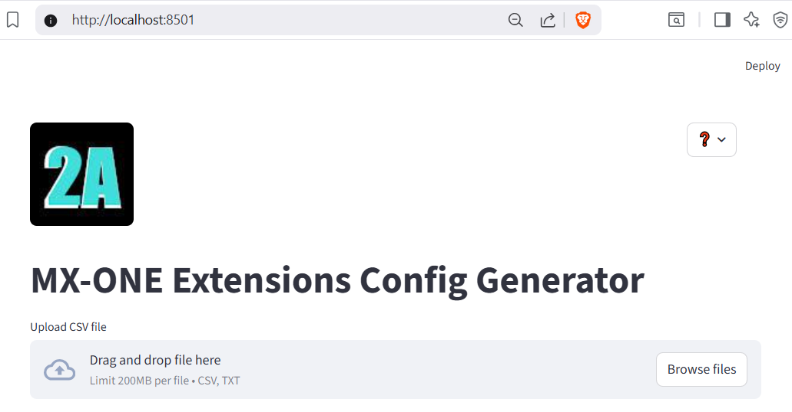
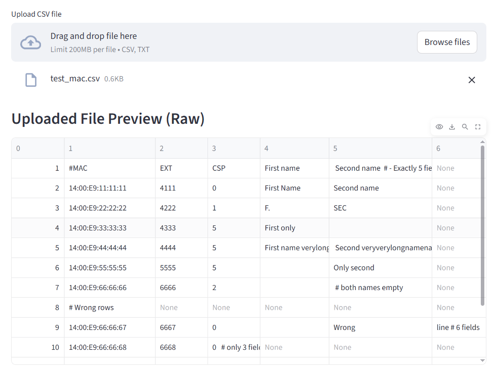
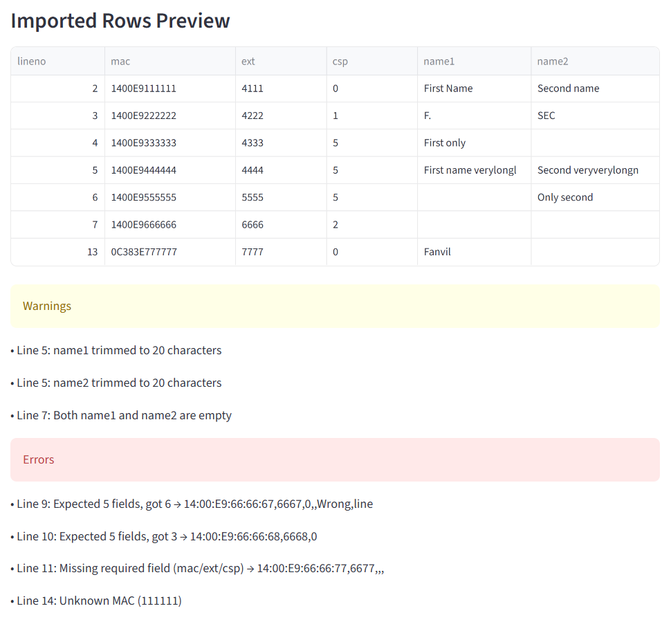
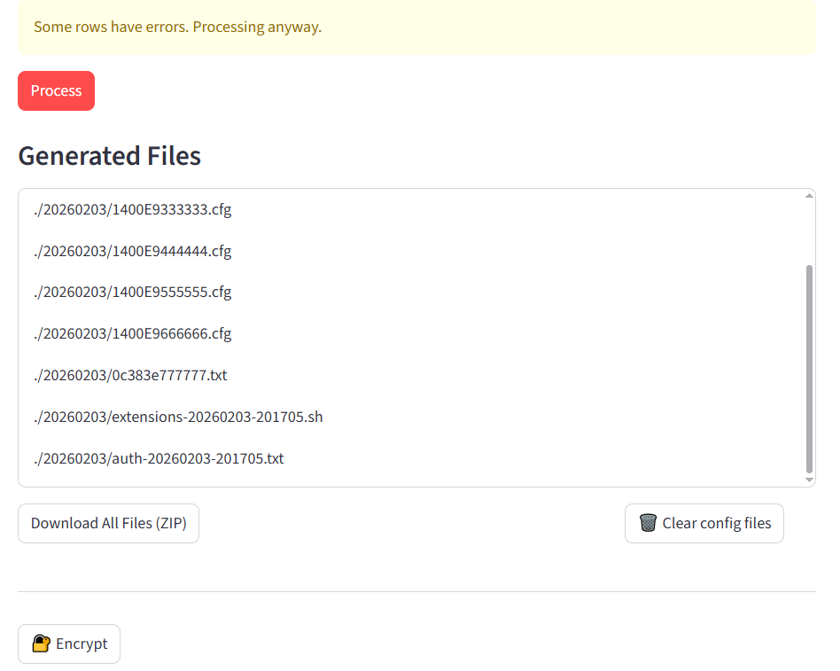
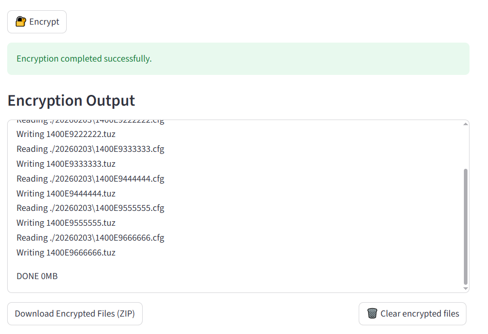

# Generate SIP and analog phones configuration files for MX-ONE

## SIP Phone Registration and Configuration with MX-ONE PBX

When SIP phones register with the MX-ONE PBX, you can link each phone's unique MAC address to a specific extension number. The phone then attempts to download its configuration file from the IP Phone Configuration Server (e.g., HTTP or HTTPS server). This application automatically generate configurations for MX-ONE and phones contains the following:

- Extension numbers for the phones
- Common Service Profile numbers
- Extension's first and second names
- Authentication codes
- SIP server IP addresses

You can use the python script `gen_ext_conf.py` in a command line interface (CLI) or run a Web UI application.

### Running Web UI

This project provides a web-based interface built with the Streamlit Python framework.

Start the application by running:

```sh
streamlit run app.py
```

Once started, open your web browser and navigate to: `http://localhost:8501/`

#### Usage Guide

##### Step 1: Upload a CSV File

Use the `Browse files` button to select and upload a CSV file.



##### Step 2: Preview Uploaded CSV (`test_mac.csv`)

After uploading, the application displays a preview of the CSV file contents for verification.



It automatically detects "," or ";" CSV file delimiter.

##### Step 3: Review Imported Rows

Check the imported rows to ensure the data has been parsed correctly.



##### Step 4: Generate Configuration Files

Process the imported rows and download the generated configuration files as a single ZIP archive.



##### Step 5: Encrypt and Download Files

Encrypt the generated configuration files and download the encrypted output as a ZIP archive.




### Configuration Files Generation with `gen_ext_conf.py`

The `gen_ext_conf.py` script automates the generation of configuration files for each phone. It creates a unique authentication code for each phone per each MAC address. The process relies on a pre-prepared file with default name `test_mac.csv`, which contains a list of MAC addresses, their corresponding extension numbers, Common Service Profile (CSP) numbers and names.

Depending from MAC address vendor, the script generates different MAC configs for Mitel and Fanvil SIP-phones.

### MX-ONE Shell Commands for Authentication

In addition to generating configuration files, the `gen_ext_conf.py` script also generates a set of MX-ONE shell commands. These commands, saved in the `extensions.sh` file, are used in the PBX CLI to set authentication codes for each extension. When using the `MD5a1` format for authentication codes, the passwords are securely hashed and are not visible in plain text. However, the clear-text passwords are saved in the `auth.txt` output file.

## Input file `test_mac.csv` format
MAC,EXTENTION,CSP,Name1,Name2

### Example of `test_mac.csv` input file
```
#MAC,EXT,CSP,First name, Second name  # - Exactly 5 fields
14:00:E9:11:11:11,1111,0,First Name,Second name
14:00:E9:22:22:22,2222,1,F.,SEC
14:00:E9:33:33:33,3333,5,First only,
14:00:E9:44:44:44,4444,5,First name verylonglonglong, Second veryverylongnamename
14:00:E9:55:55:55,5555,5,,Only second
14:00:E9:66:66:66,6666,2,,  # both names empty
# Wrong rows
14:00:E9:66:66:67,6667,0,,Wrong,line # 6 fields
14:00:E9:66:66:68,6668,0    # only 3 fields
14:00:E9:66:66:77,6677,,,   # no csp
# MAC
0C:38:3E:77:77:77,7777,0,Fanvil,
11:11:11:11:11:11,1111,0,Wrong,MAC
```

_Note_: The `Name1` and `Name2` fields are limited to 20 characters in MX-ONE and will be truncated by the script to avoid command execution errors.

## gen_ext_conf.py

The script allows you to configure the input CSV file separator, choose the desired password length and SIP proxy IP address.

```python
TEST = True

DELIM = ","    # CSV file separator
DIGITS = 14    # length of auth code
SIP_PROXY = "192.168.1.11"
```

If the constant `TEST` is set to `True`, the output will be generated in the `_test` folder, otherwise will be created a folder with a date as a name in `YYYYMMDD` format.

Run the script `gen_ext_conf.py <mac.csv>`:
```
$ python ./gen_ext_conf.py

Using default 'test_mac.csv' file for input
20260203-204734
Generated 9 config files

Warnings (3):
  - Line 5: name1 trimmed to 20 characters
  - Line 5: name2 trimmed to 20 characters
  - Line 7: Both name1 and name2 are empty

Completed with 4 errors:
  - Line 9: Expected 5 fields, got 6 -> 14:00:E9:66:66:67,6667,0,,Wrong,line
  - Line 10: Expected 5 fields, got 3 -> 14:00:E9:66:66:68,6668,0
  - Line 11: Missing required field (mac/ext/csp) -> 14:00:E9:66:66:77,6677,,,
  - Line 14: Unknown MAC (111111)

Test exit!
```

## Output files created in a sub-directory `<date>`

- `<MAC>.cfg` files
- file with passwords: `auth-<date-time>.txt`
- file with commands: `extensions-<date-time>.sh` (Unix LF)
- `<MAC>.tuz` encrypted files (generated in a local folder)

### Generated config MAC file `1400E9111111.cfg` example for Mitel 6800/6900 phones

```
sip line1 user name:1111
sip line1 auth name:1111
sip line1 password:9T8diiFgouUhZm
sip proxy ip:192.168.1.11
sip registrar ip:192.168.1.11
```

For Fanvil SIP-phones will be generated a different MAC config file `0c383e777777.txt`:

```
#<Voip Config File>#
Version = 2.0000000000

sip.line.1.PhoneNumber = 7777
sip.line.1.DisplayName = 7777
sip.line.1.RegUser = 7777
sip.line.1.SipName = 192.168.1.11
sip.line.1.RegAddr = 192.168.1.11
sip.line.1.RegPswd = UXNj2tVhaDhvUh
sip.line.1.RegEnabled = 1
sip.line.1.ProxyAddr = 192.168.1.11
```

### `auth-<date-time>.txt` output example

```
1111,9T8diiFgouUhZm
2222,YLgLS5qOLfu6u0
3333,GJHIDE4ZQPy7WJ
4444,wIXM3jvudgAV5H
5555,bfMjFG5pTxMvrJ
6666,yEeQd1TUk2qqYR
7777,UXNj2tVhaDhvUh
```

### `extensions-<date-time>.sh` output example

```sh
extension -i -d 1111 --csp 0 -l 1
extension -i -d 2222 --csp 1 -l 1
extension -i -d 3333 --csp 5 -l 1
extension -i -d 4444 --csp 5 -l 1
extension -i -d 5555 --csp 5 -l 1
extension -i -d 6666 --csp 2 -l 1
extension -i -d 7777 --csp 0 -l 1 --third-party-client yes
ip_extension -i -d 1111 --protocol sip
ip_extension -i -d 2222 --protocol sip
ip_extension -i -d 3333 --protocol sip
ip_extension -i -d 4444 --protocol sip
ip_extension -i -d 5555 --protocol sip
ip_extension -i -d 6666 --protocol sip
ip_extension -i -d 7777 --protocol sip
name -i -d 1111 --name1 "First Name" --name2 "Second name" --number-type dir
name -i -d 2222 --name1 "F." --name2 "SEC" --number-type dir
name -i -d 3333 --name1 "First only" --number-type dir
name -i -d 4444 --name1 "First name verylongl" --name2 "Second veryverylongn" --number-type dir
name -i -d 5555 --name2 "Only second" --number-type dir
name -i -d 7777 --name1 "Fanvil" --number-type dir
auth_code -i -d 1111 --csp 0 --cil 1111 --customer 0 --hash-type md5a1 --auth-code 9T8diiFgouUhZm
auth_code -i -d 2222 --csp 1 --cil 2222 --customer 0 --hash-type md5a1 --auth-code YLgLS5qOLfu6u0
auth_code -i -d 3333 --csp 5 --cil 3333 --customer 0 --hash-type md5a1 --auth-code GJHIDE4ZQPy7WJ
auth_code -i -d 4444 --csp 5 --cil 4444 --customer 0 --hash-type md5a1 --auth-code wIXM3jvudgAV5H
auth_code -i -d 5555 --csp 5 --cil 5555 --customer 0 --hash-type md5a1 --auth-code bfMjFG5pTxMvrJ
auth_code -i -d 6666 --csp 2 --cil 6666 --customer 0 --hash-type md5a1 --auth-code yEeQd1TUk2qqYR
auth_code -i -d 7777 --csp 0 --cil 7777 --customer 0 --hash-type md5a1 --auth-code UXNj2tVhaDhvUh
```

The option "--third-party-client yes" will be added for non-Mitel MAC-addresses.

_Note_: The `extensions.sh` file should be prepared with Linux lines end format (LF). You can convert the shell script from Windows (CR LR) format using Linux utility `dos2unix` in MX-ONE CLI before execution.

```sh
mx-one$ sh ./extensions.sh
```

## Encrypting Configuration Files

For enhanced security, the generated configuration (`cfg`) files can be encrypted using the `anacrypt` utility. After encryption, the configuration files are stored as `tuz` files, which are then uploaded to the Configuration Server, replacing the original unencrypted `cfg` files.

The `anacrypt` utility, available from the Mitel SW Download Center, allows you to securely encrypt configuration files for SIP phones. It encrypts all `cfg` files in the current directory (`./`) into `tuz` format using a specified password.

```sh
anacrypt -d ./ -m -p password1234 -i
```

### Steps to Encrypt and Deploy Configuration Files:

1. **Encrypt Configuration Files**: Use the `anacrypt` utility to encrypt all `cfg` files in the current directory into `tuz` files. This ensures that the configuration data is protected.
   
2. **Copy Encrypted Files**: After encryption, transfer the generated `tuz` files, along with the created `security.tuz` file, to the Configuration Server.

3. **Download and Decrypt**: The SIP phone will then download the encrypted `tuz` files from the IP Phone Configuration Server, decrypt them using the provided password, and automatically apply the configuration.

The password for encryption will be read by the python script from the local file with the name `key_mitel`.

For Fanvil phones is used `dsc.exe` encryption utility with a key stored in a `key_fanvil` local file.

Then copy all files to a remote config server using `scp`.

This process ensures secure and efficient registration and configuration of SIP phones on the MX-ONE PBX, leveraging automated scripts and encryption for added security.


# Create analog extensions in a bulk

Configuration:
```
BOARD = "1A-0-00-%s"
START_PORT = 0
END_PORT = 31
START_EXT = 200
```

Run the script:
```
python extei.py
```

## Output extei.mdsh example

```
EXTEI:DIR=200,TYPE=EL6,EQU=1A-0-00-0,CSP=0,ICAT=8020000;
EXTEI:DIR=201,TYPE=EL6,EQU=1A-0-00-1,CSP=0,ICAT=8020000;
EXTEI:DIR=202,TYPE=EL6,EQU=1A-0-00-2,CSP=0,ICAT=8020000;
```


# Generate SIP phones configuration files for MX-ONE (v1)

## Input file "mac.csv" format
MAC,EXTENTION,CSP

### Example "mac.csv"
```
14:00:E9:11:11:11,101,0
14:00:E9:11:11:12,102,0
14:00:E9:11:11:13,103,1
```

## gen_ext_conf_v1.py

The script allows you to configure the input CSV file separator, choose the desired password length and SIP proxy IP address.

```python
DELIM = "," # CSV file separator
DIG = 14    # length of auth code
SIP_PROXY = "192.168.1.11"
```

Run the script:
```
$ python gen_ext_conf_v1.py
Generated 3 config files
```

## Output files created in a sub-directory `<date>`
- `<MAC>.cfg` files
- `<MAC>.tuz` encrypted files
- file with passwords: `auth-<date-time>.txt`
- file with commands: `extensions-<date-time>.sh`

### `1400E9111111.cfg`

```
sip line1 user name:101
sip line1 auth name:101
sip line1 password:n0l0VoB11QNkxU
sip proxy ip:"192.168.1.11"
sip registrar ip:"192.168.1.11"
```

### `auth-<date-time>.txt`

```
101,n0l0VoB11QNkxU
102,pY9BwjbJHXVmFq
103,Y6cN2O144k7QyX
```

### `extensions-<date-time>.sh`

```sh
extension -i -d 101 --csp 0 -l 1
extension -i -d 102 --csp 0 -l 1
extension -i -d 103 --csp 1 -l 1
ip_extension -i -d 101 --protocol sip
ip_extension -i -d 102 --protocol sip
ip_extension -i -d 103 --protocol sip
auth_code -i -d 101 --csp 0 --cil 101 --customer 0 --hash-type md5a1 --auth-code n0l0VoB11QNkxU
auth_code -i -d 102 --csp 0 --cil 102 --customer 0 --hash-type md5a1 --auth-code pY9BwjbJHXVmFq
auth_code -i -d 103 --csp 1 --cil 103 --customer 0 --hash-type md5a1 --auth-code Y6cN2O144k7QyX
```
